# Trip Genie 🧞‍♂️

<p align="center">
  
</p>

[](https://git.io/typing-svg)

A comprehensive travel and tourism platform that enables users to book flights, hotels, transportation, activities, and explore historical places while also providing a marketplace for travel-related products.

## Table of Contents

- [Motivation](#motivation)
- [Build Status](#build-status)
- [Code Examples](#code-examples)
- [Code Style](#code-style)
- [Screenshots](#screenshots)
- [Tech/Framework Used](#techframework-used)
- [Features](#features)
- [Installation](#installation)
- [API Reference](#api-reference)
- [Tests](#tests)
- [How to Use](#how-to-use)
- [Contribute](#contribute)
- [Contributors](#contributors)
- [Credits](#credits)
- [License](#license)

## Motivation

Trip Genie was created to revolutionize the travel planning experience by providing a one-stop solution for travelers. The platform bridges the gap between tourists, local guides, and businesses, making travel planning seamless and enriching.

## Build Status

- ✅ Development: Active
- 🚀 Current Version: 1.0.0
- 💻 Platform: Web Application

<details>
  <summary>Current issues and problems</summary>
- Constant refreshing of the cards in activities and itineraries and they keep refreshing even after the loading ends </br>
- Some notifications return visible HTML tags in the body  </br>
- Add an option to copy the promocode directly from the notifications  </br>
- Cancel button for updating any activity/itinerary so that the user doesn't rely on the browser's back button  </br>
- Update notifications enum and remove outdated notification types  </br>
- Promocode is forced to be entered in the checkout process but sometimes the user may not want to use the promo code  </br>
- If the wallet isn't enough, don't remove the product from the cart  </br>
- Cash on delivery funds are refunded to wallet when canceled, we should not refund the amount </br>
- Add "add to wishlist" toast at the bottom in all views  </br>
- Wallet history is not updating  </br>
- Skeleton loading in hotel details needs to be added </br>
- "Currently unavailable" looks bad in the card, we need to modify the badge</br>
- Delete account toast does not have consistent styling with the other toasts and needs a proper readable error message </br>
- Comments and reviews are too wide with white spaces in between them </br>
- Add recommendations in the single activity, itinerary and product views or extra info  </br>
- My bookings should be easier to access or have a link directly from the confirmation pop up </br>
- Drop-downs and the cart should close when clicking outside  </br>
- Any white space, we can add quick access to items in settings  </br>
- Too many popups, unnecessary if something already indicates change   </br>
- Adding to cart after checkout should remove it from the wishlist  </br>
- In the checkout the wallet sometimes glitches and doesn't update the wallet to the user properly and may even show negative balance (FE only) </br>
- Find a different approach for sorting by preferences as it increases the loading per page as it is not done efficiently </br>
- Advertiser cannot delete/update their activity from outside (all activities). </br>
- The admin should be able to delete any itinerary even if they were not theirs. </br>
- Booking confirmation pop-ups are not consistent. </br>
- No popup for flagging inappropriate itineraries.
- All toast messages should be top right instead of having some being bottom right. </br>
- Adding an image to a product when updating sometimes causes the product to lag and not update. </br>
- Flights, hotels, and transport should be in one component on the homepage. </br>
- Graph in admin dashboard takes a long time to load. </br>
- The color of the 'flag inappropriate' in admin activities is different from itineraries. </br>
- You can still see the booking screen for  an Itinerary even if the booking is closed if you select the date from the calendar </br>

</details>

## Code Examples

### Displaying Itineraries Frontend Example (React)

```jsx
import React, { useState, useEffect } from "react";
import axios from "axios";

function ItineraryList() {
  const [itineraries, setItineraries] = useState([]);

  useEffect(() => {
    const fetchItineraries = async () => {
      try {
        const response = await axios.get("/tourist/itineraries");
        setItineraries(response.data);
      } catch (error) {
        console.error("Error fetching itineraries:", error);
      }
    };

    fetchItineraries();
  }, []);

  return (
    <div>
      <h2>Available Itineraries</h2>
      <ul>
        {itineraries.map((itinerary) => (
          <li key={itinerary._id}>{itinerary.name}</li>
        ))}
      </ul>
    </div>
  );
}

export default ItineraryList;
```

### Displaying Itineraries Backend Example (Express.js)

```javascript
const express = require("express");
const router = express.Router();
const itineraryController = require("../controllers/itineraryController");

router.get("/itineraries", itineraryController.getAllItineraries);
router.get("/itineraries/:id", itineraryController.getItineraryById);
router.post("/itineraries", itineraryController.createItinerary);
router.put("/itineraries/:id", itineraryController.updateItinerary);
router.delete("/itineraries/:id", itineraryController.deleteItinerary);

module.exports = router;
```

### Login Frontend Example (React)

```jsx
import React, { useState, useEffect } from "react";
import axios from "axios";

const Login = () => {
  const [identifier, setIdentifier] = useState("");
  const [password, setPassword] = useState("");

  const handleSubmit = async (event) => {
    event.preventDefault();

    if (!isValid) {
      setLoginErrorMessage("Please fix the errors before submitting.");
      return;
    }

    const requestBody = {
      username: identifier,
      password,
    };

    try {
      const response = await fetch(
        "https://trip-genie-apis.vercel.app/auth/login",
        {
          method: "POST",
          credentials: "include",
          headers: {
            "Content-Type": "application/json",
          },
          body: JSON.stringify(requestBody),
        }
      );

      if (response.ok) {
        const data = await response.json();
        role = data.role;

        if (role === "admin") {
          navigate("/admin");
        } else {
          navigate("/");
        }
        console.log("Login successful!");
        window.location.reload();
      } else {
        const errorData = await response.json();

        if (errorData.message === "Your account is not accepted yet") {
          setLoginErrorMessage(
            "Login failed. Your account is not accepted yet."
          );
        } else {
          setLoginErrorMessage("Login failed. Please check your credentials.");
        }
      }
    } catch (error) {
      setLoginErrorMessage("An error occurred during login. Please try again.");
    }
  };

  return (
    <div>
      <form className="space-y-6" onSubmit={handleSubmit}>
        <div>
          <label
            htmlFor="identifier"
            className="block text-sm font-medium text-gray-700"
          >
            Email/Username
          </label>
          <div className="mt-1">
            <input
              id="identifier"
              name="identifier"
              type="text"
              autoComplete="identifier"
              placeholder="Email/Username"
              required
              className="appearance-none block w-full px-3 py-2 border border-gray-300 rounded-md placeholder-gray-400 focus:outline-none focus:ring-orange-500 focus:border-orange-500 sm:text-sm"
              value={identifier}
              onChange={(e) => {
                setIdentifier(e.target.value);
                validateIdentifier(e.target.value);
              }}
            />
          </div>
        </div>

        <div>
          <label
            htmlFor="password"
            className="block text-sm font-medium text-gray-700"
          >
            Password
          </label>
          <div className="mt-1 relative">
            <input
              id="password"
              name="password"
              type={showPassword ? "text" : "password"}
              autoComplete="current-password"
              placeholder="Password"
              required
              className="appearance-none block w-full px-3 py-2 border border-gray-300 rounded-md placeholder-gray-400 focus:outline-none focus:ring-orange-500 focus:border-orange-500 sm:text-sm"
              value={password}
              onChange={(e) => setPassword(e.target.value)}
            />
            {password.length > 0 && (
              <button
                type="button"
                onClick={() => setShowPassword(!showPassword)}
                className="absolute inset-y-0 right-0 px-3 flex items-center text-gray-500 focus:outline-none"
                aria-label={showPassword ? "Hide password" : "Show password"}
              >
                {showPassword ? (
                  <EyeOffIcon className="h-5 w-5" />
                ) : (
                  <EyeIcon className="h-5 w-5" />
                )}
              </button>
            )}
          </div>
          <div className="mt-1 flex justify-end">
            <button
              type="button"
              onClick={() => setForgotPasswordStep(1)}
              className="text-sm font-medium text-[#5D9297] hover:text-[#B5D3D1]"
            >
              Forgot password?
            </button>
          </div>
          {loginErrorMessage && (
            <p
              className={`text-sm mt-1 ${
                loginErrorMessage ===
                "Password reset successfully. Please log in with your new password."
                  ? "text-green-600"
                  : "text-red-600"
              }`}
            >
              {loginErrorMessage}
            </p>
          )}
        </div>

        <div className="flex flex-col items-center justify-between">
          <button
            type="submit"
            className={`w-full flex justify-center mb-2 py-2 px-4 border border-transparent rounded-md shadow-sm text-sm font-medium text-white bg-[#5D9297] text-white hover:bg-[#1A3B47] focus:outline-none focus:ring-2 focus:ring-offset-2 focus:ring-orange-500 ${
              !isValid ? "cursor-not-allowed hover:bg-[#5D9297]" : ""
            }`}
            disabled={!isValid}
          >
            Log in
          </button>
          <p className="text-gray-600">
            Don't have an account?{" "}
            <Link
              to="/sign-up"
              className="font-medium text-[#5D9297] hover:text-[#B5D3D1]"
            >
              Sign up now!
            </Link>
          </p>
          <button
            className="w-full flex justify-center px-4 rounded-md font-medium text-[#5D9297] hover:text-[#B5D3D1]"
            onClick={() => {
              console.log("Logging out...");
              logOut();
              navigate("/");
            }}
          >
            Continue as guest
          </button>
        </div>
      </form>
    </div>
  );
};

export default ItineraryList;
```

### Login Backend Example (Express.js)

```javascript
const express = require("express");
const router = express.Router();
const authController = require("../controllers/authController");

router.post("/login", authController.login);

const login = async (req, res) => {
  let { username, password } = req.body;
  username = username.toLowerCase();

  try {
    let role = "";
    let user = null;
    if (
      (await Tourist.findOne({ email: username })) ||
      (await Tourist.findOne({ username }))
    ) {
      role = "tourist";
      user = await Tourist.login(username, password);
    } else if (
      (await TourGuide.findOne({ email: username })) ||
      (await TourGuide.findOne({ username }))
    ) {
      role = "tour-guide";
      user = await TourGuide.login(username, password);
    } else if (
      (await Advertiser.findOne({ email: username })) ||
      (await Advertiser.findOne({ username }))
    ) {
      role = "advertiser";
      user = await Advertiser.login(username, password);
    } else if (
      (await Seller.findOne({ email: username })) ||
      (await Seller.findOne({ username }))
    ) {
      role = "seller";
      user = await Seller.login(username, password);
    } else if (
      (await Admin.findOne({ email: username })) ||
      (await Admin.findOne({ username }))
    ) {
      role = "admin";
      user = await Admin.login(username, password);
    } else if (
      (await TourismGovernor.findOne({ email: username })) ||
      (await TourismGovernor.findOne({ username }))
    ) {
      role = "tourism-governor";
      user = await TourismGovernor.login(username, password);
    } else {
      res.cookie("jwt", "", { maxAge: 1 });
      res.cookie("role", "", { maxAge: 1 });
      throw new Error("Email not found");
    }

    const token = createToken(user._id, role);
    res.cookie("jwt", token, {
      httpOnly: false,
      maxAge: process.env.MAX_AGE * 1000,
    });
    res.cookie("role", role, {
      httpOnly: false,
      maxAge: process.env.MAX_AGE * 1000,
    });
    res.setHeader("Authorization", `Bearer ${token}`);
    res.status(200).json({ message: "Login succesful", role });
  } catch (error) {
    res.cookie("jwt", "", { maxAge: 1 });
    res.cookie("role", "", { maxAge: 1 });
    res.status(400).json({ message: error.message });
  }
};

module.exports = router;
```

### Creating a Product Frontend Example (React)

```jsx
import React, { useState, useEffect } from "react";
import axios from "axios";
import Cookies from "js-cookie";

const CreateProductForm = () => {
  const [loading, setLoading] = useState(false);
  const [error, setError] = useState("");
  const [success, setSuccess] = useState("");
  const [showDialog, setShowDialog] = useState(false);
  const [pictures, setPictures] = useState([]);
  const [base64Pictures, setBase64Pictures] = useState([]);
  const [currencies, setCurrencies] = useState([]);
  const navigate = useNavigate();
  const userRole = Cookies.get("role") || "guest";

  const {
    register,
    handleSubmit,
    control,
    formState: { errors },
  } = useForm({
    resolver: zodResolver(formSchema),
    defaultValues: {
      name: "",
      price: "",
      description: "",
      quantity: "",
    },
  });

  useEffect(() => {
    const fetchSupportedCurrencies = async () => {
      try {
        const token = Cookies.get("jwt");
        const response = await axios.get(
          `https://trip-genie-apis.vercel.app/${userRole}/currencies`,
          {
            headers: { Authorization: `Bearer ${token}` },
          }
        );
        setCurrencies(response.data);
      } catch (error) {
        console.error("Error fetching supported currencies:", error);
      }
    };

    fetchSupportedCurrencies();
  }, []);

  const handlePicturesUpload = (e) => {
    const files = e.target.files;
    if (files) {
      setPictures([...pictures, ...Array.from(files)]);
    }

    const base64Files = Array.from(files).map((file) => {
      return new Promise((resolve, reject) => {
        const reader = new FileReader();
        reader.readAsDataURL(file);
        reader.onload = () => resolve(reader.result);
        reader.onerror = (error) => reject(error);
      });
    });
    Promise.all(base64Files).then((base64Files) => {
      setBase64Pictures([...base64Pictures, ...base64Files]);
    });
  };

  const removePicture = (index) => {
    const updatedPictures = pictures.filter((_, i) => i !== index);
    const updatedBase64Pictures = base64Pictures.filter((_, i) => i !== index);
    setPictures(updatedPictures);
    setBase64Pictures(updatedBase64Pictures);
  };

  const onSubmit = async (data) => {
    setLoading(true);
    setError("");
    setSuccess("");

    const formData = new FormData();
    formData.append("name", data.name);
    formData.append("price", data.price);
    formData.append("description", data.description);
    formData.append("quantity", data.quantity);
    pictures.forEach((picture, index) => {
      formData.append("pictures", picture);
    });

    const token = Cookies.get("jwt");
    try {
      const response = await axios.post(
        `https://trip-genie-apis.vercel.app/${userRole}/products`,
        formData,
        {
          headers: {
            Authorization: `Bearer ${token}`,
            "Content-Type": "multipart/form-data",
          },
        }
      );
      console.log("Server response:", response.data);
      setSuccess("Product created successfully!");
      setShowDialog(true);
    } catch (err) {
      setError("Failed to create product. Please try again.");
      console.error(
        "Error creating product:",
        err.response ? err.response.data : err.message
      );
    } finally {
      setLoading(false);
    }
  };

  const handleGoBack = () => {
    setShowDialog(false);
    navigate("/all-products");
  };

  const handleCreateNew = () => {
    setShowDialog(false);
    window.location.reload();
  };

  return (
    <div>
      <div className="w-full bg-[#1A3B47] py-8 top-0 z-10">
        <div className="max-w-7xl mx-auto px-4 sm:px-6 lg:px-8"></div>
      </div>
      <div
        className="flex min-h-screen  items-center justify-center bg-cover bg-center bg-no-repeat p-2"
        style={{
          backgroundImage: `url(${backgroundPicture})`,
        }}
      >
        <div className="bg-white rounded-xl shadow-xl overflow-hidden w-full max-w-4xl flex flex-col md:flex-row">
          <div className="w-full md:w-2/5 bg-[#B5D3D1] p-6">
            <h2 className="text-3xl font-bold text-[#1A3B47] mb-2">
              Create New Product
            </h2>
            <p className="text-sm mb-6 text-[#1A3B47]">
              Add a new product to your inventory. Fill in the details carefully
              to ensure accurate product information.
            </p>
          </div>
          <div className="w-full md:w-3/5 p-6">
            <form onSubmit={handleSubmit(onSubmit)} className="space-y-6">
              <div className="space-y-2">
                <Label htmlFor="name" className="text-sm font-medium">
                  Product Name
                </Label>
                <Input id="name" {...register("name")} />
                {errors.name && (
                  <p className="text-red-500 text-xs">{errors.name.message}</p>
                )}
              </div>
              <div className="grid grid-cols-2 gap-4">
                <div className="space-y-2">
                  <Label htmlFor="quantity" className="text-sm font-medium">
                    Quantity
                  </Label>
                  <Input
                    id="quantity"
                    type="number"
                    {...register("quantity", { valueAsNumber: true })}
                  />
                  {errors.quantity && (
                    <p className="text-red-500 text-xs">
                      {errors.quantity.message}
                    </p>
                  )}
                </div>
                <div className="space-y-2">
                  <Label htmlFor="price" className="text-sm font-medium">
                    Price (in USD)
                  </Label>
                  <Input
                    id="price"
                    type="number"
                    {...register("price", { valueAsNumber: true })}
                  />
                  {errors.price && (
                    <p className="text-red-500 text-xs">
                      {errors.price.message}
                    </p>
                  )}
                </div>
              </div>
              <div className="space-y-2">
                <Label htmlFor="description" className="text-sm font-medium">
                  Description (min. 200 characters)
                </Label>
                <Textarea
                  id="description"
                  {...register("description")}
                  className="h-24"
                />
                {errors.description && (
                  <p className="text-red-500 text-xs">
                    {errors.description.message}
                  </p>
                )}
              </div>
              <div className="space-y-2">
                <Label htmlFor="pictures" className="text-sm font-medium">
                  Product Pictures
                </Label>
                <Input
                  id="pictures"
                  type="file"
                  multiple
                  onChange={handlePicturesUpload}
                />
              </div>
              <div className="grid grid-cols-3 gap-4 mt-4">
                {base64Pictures.map((picture, index) => (
                  <div key={`new-${index}`} className="relative">
                     {
                        setSelectedImage(picture);
                      }}
                    />
                    <button
                      type="button"
                      onClick={() => removePicture(index)}
                      className="absolute top-0 right-0 bg-red-500 text-white rounded-full p-1"
                    >
                      <X size={16} />
                    </button>
                  </div>
                ))}
              </div>
              {error && (
                <Alert variant="destructive">
                  <AlertDescription>{error}</AlertDescription>
                </Alert>
              )}
              <Button
                type="submit"
                className="w-full bg-[#5D9297] text-white hover:bg-[#1A3B47]"
                disabled={loading}
              >
                {loading ? "Creating..." : "Create Product"}
              </Button>
            </form>
          </div>
        </div>

        <Dialog open={showDialog} onOpenChange={setShowDialog}>
          <DialogContent>
            <DialogHeader>
              <DialogTitle>Success!</DialogTitle>
              <DialogDescription>
                The Product was created successfully.
              </DialogDescription>
            </DialogHeader>
            <DialogFooter>
              <Button className="bg-[#5D9297]" onClick={handleGoBack}>
                Go to all products
              </Button>
              <Button variant="outline" onClick={handleCreateNew}>
                Create Another
              </Button>
            </DialogFooter>
          </DialogContent>
        </Dialog>
      </div>
    </div>
  );
};
export default CreateProductForm;
```

### Creating a Product Backend Example (Express.js)

```javascript
const addProduct = async (req, res) => {
  const { name, price, description, quantity } = req.body;

  try {
    let imagesBuffer = [];
    const pictures = req.files.map(
      (file) => `data:image/jpeg;base64,${file.buffer.toString("base64")}`
    );

    for (let i = 0; i < pictures.length; i++) {
      const result = await cloudinary.uploader.upload(pictures[i], {
        folder: "products",
      });

      imagesBuffer.push({
        public_id: result.public_id,
        url: result.secure_url,
      });
    }

    const product = new Product({
      name,
      pictures: imagesBuffer,
      price,
      description,
      seller: res.locals.user_id,
      quantity,
      currency: "67140446ee157ee4f239d523",
    });

    await product.save();
    res.status(201).json(product);
  } catch (error) {
    res.status(400).json({ error: error.message });
  }
};
module.exports = addProduct;
```

## Code Style

The project follows modern web development practices and conventions:

- React with JavaScript
- Tailwind CSS for styling
- ESLint + Prettier for code formatting
- Component-based architecture
- Role-based access control

- **Indentation:** The code is formatted to use 4 spaces for indentation. No tabs.
- **Line Length:** The code is limited to 80 characters per line.
- **Function and Variable Names:** Function and variable names are written in `camelCase`.
- **Class Names:** Class names use `PascalCase`.
- **Constants:** Constants are written in `UPPERCASE_WITH_UNDERSCORES`.
- **Imports:** Imports are organized into three sections in this order: standard libraries, third-party libraries, local imports.
- **Comments:** Comments are written clearly and concisely, using full sentences and providing meaningful descriptions. All functions are documented with JSDoc.
- **Whitespace:**
  - Trailing whitespaces are avoided.
  - A single blank line is used to separate functions.
  - Two blank lines are used to separate classes.
- **Braces:** Opening braces for blocks are placed on the same line as the statement.
- **Self-Closing Tags:** Self-closing tags are used for components without children.
- **Error Handling:** Exceptions and errors are handled gracefully using `try-catch` blocks where necessary.
- **Naming Conventions:** Consistent naming conventions are followed for functions, variables, classes, and files.
- **Prettier Configuration:** Prettier is set up with default settings to automatically format the code.

### Prettier Configuration

```json
{
  "printWidth": 80,
  "tabWidth": 4,
  "singleQuote": true,
  "trailingComma": "all",
  "bracketSpacing": true,
  "jsxBracketSameLine": true,
  "semi": true
}
```

## Screenshots

<details>
<summary>Home Page</summary>
<p align="center">
  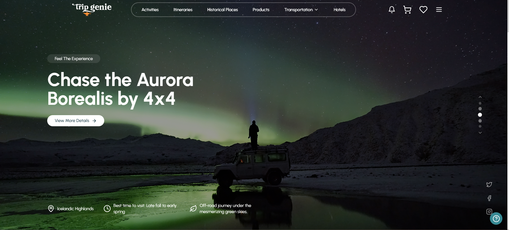
</p>
  <p align="center">
  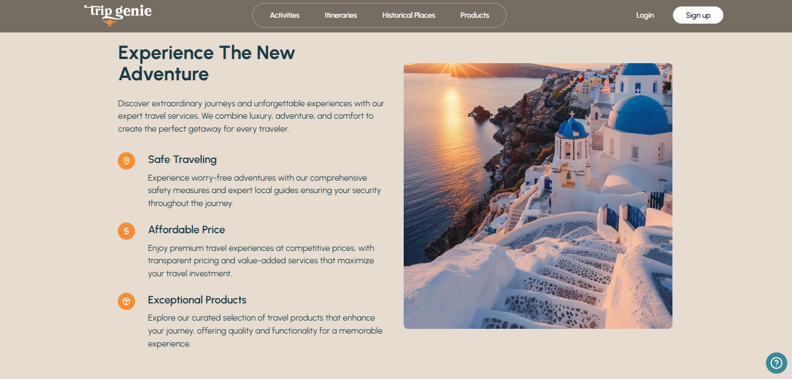
</p>
</details>

<details>
<summary>View your Bookings</summary>
<p align="center">
  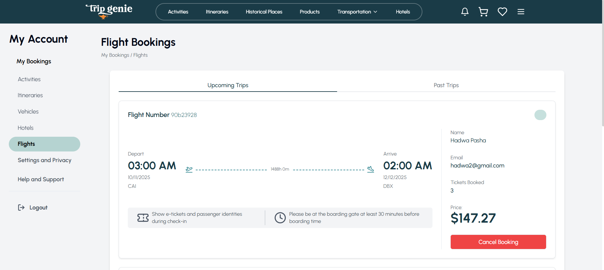
</p>
</details>

<details>
<summary>View available itineraries</summary>
<p align="center">
  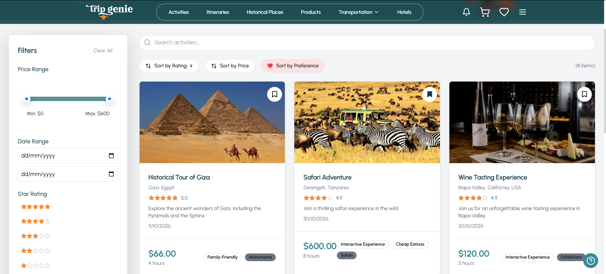
</p>
</details>

<details>
<summary>Purchase from our travel gift shop</summary>
<p align="center">
  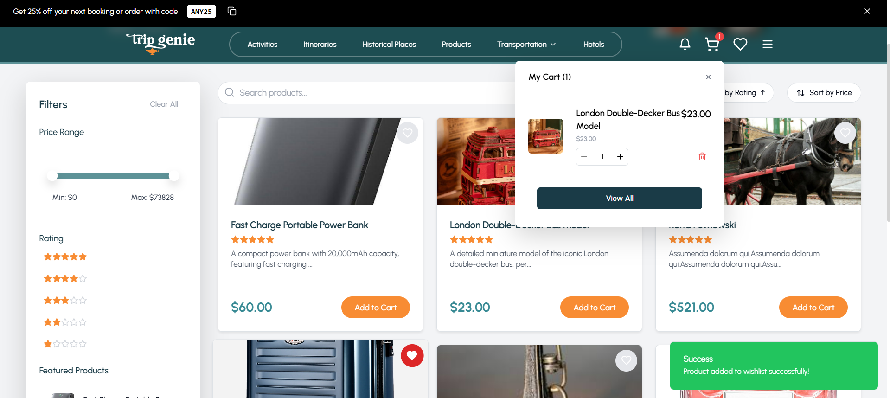
</p>
</details>

<details>
<summary>Book a Hotel</summary>
    <p align="center">
  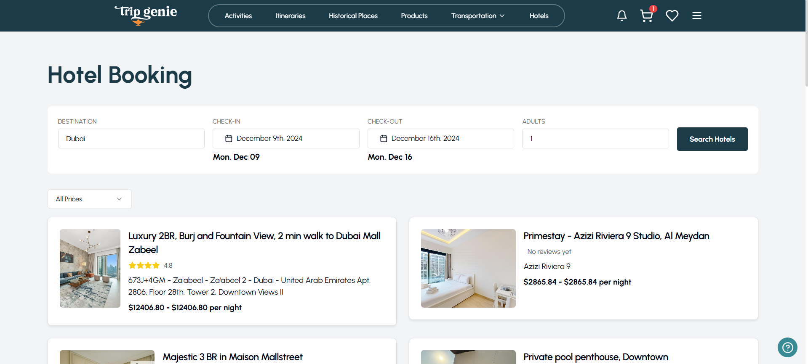
</p>
<p align="center">
  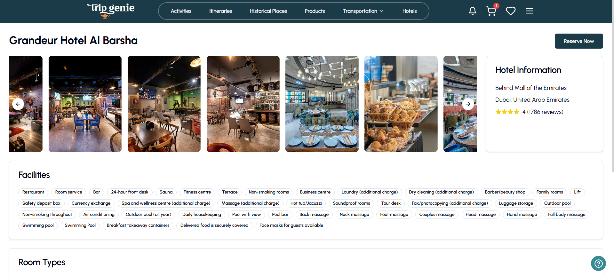
</p>

</details>

<details>
<summary>View your Profile</summary>
<p align="center">
  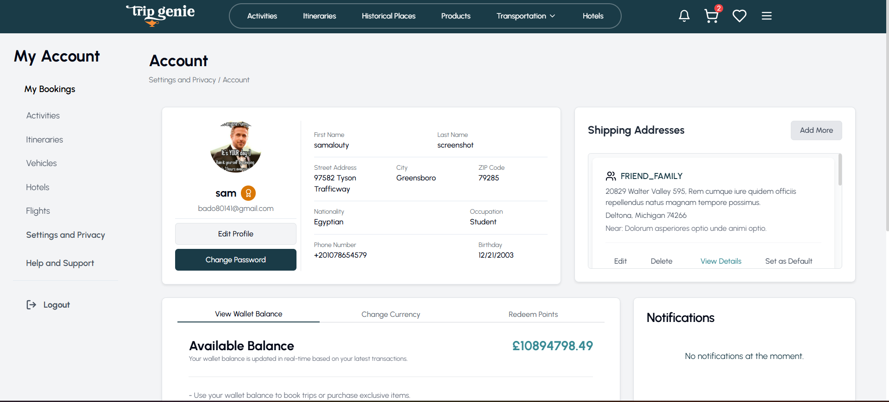
</p>
</details>

<details>
<summary>Transportation Booking</summary>
<p align="center">
  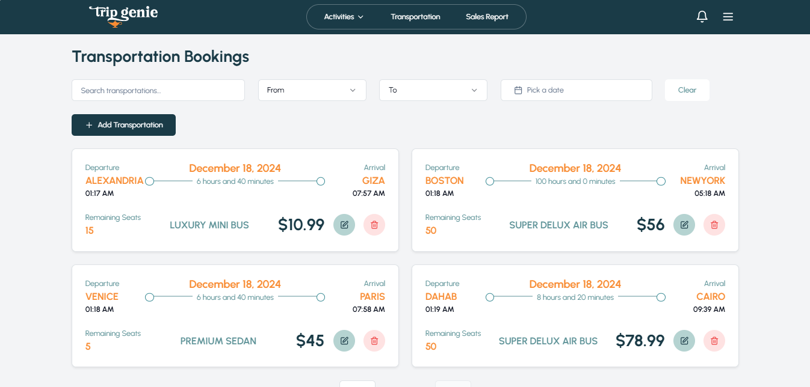
</p>
</details>

<details>
<summary>Sign-Up Page</summary>
<p align="center">
  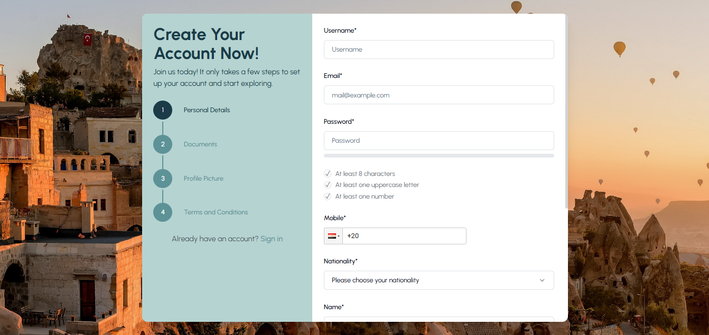
</p>
</details>

<details>
<summary>Create Itinerary Page</summary>
<p align="center">
  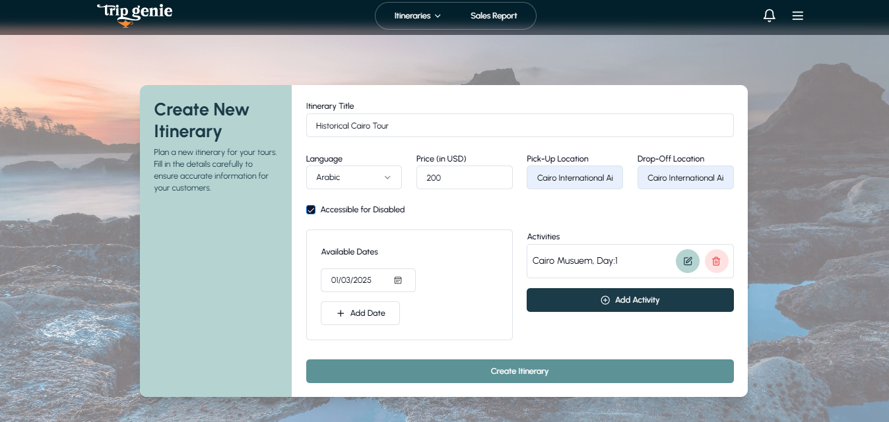
</p>
</details>

<details>
<summary>Tour Guide Profile</summary>
<p align="center">
  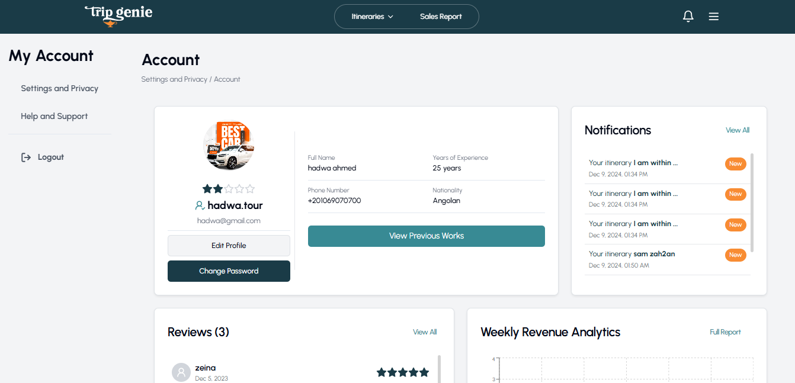
</p>
</details>

<details>
<summary>Notifications Page</summary>
<p align="center">
  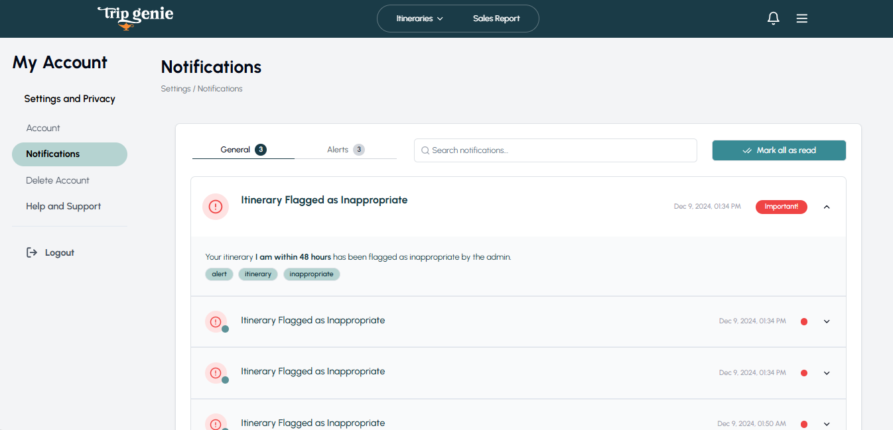
</p>
</details>

<details>
<summary>Admin Dashboard</summary>
<p align="center">
  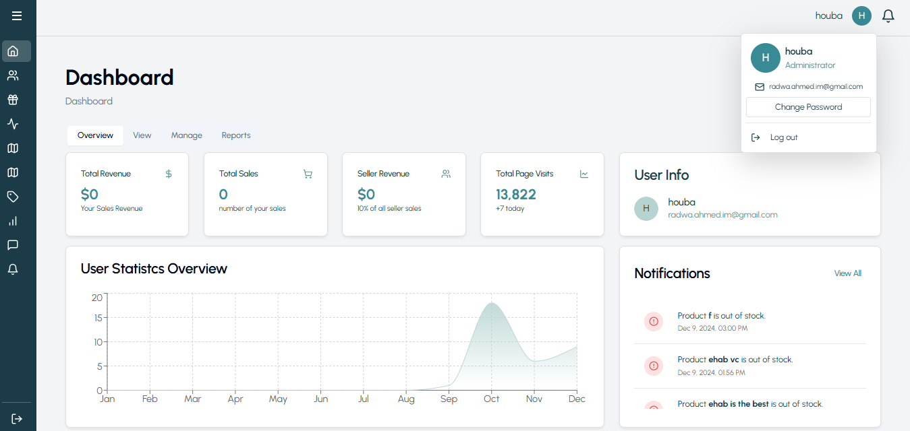
</p>
</details>

<details>
<summary>User Statistics</summary>
<p align="center">
  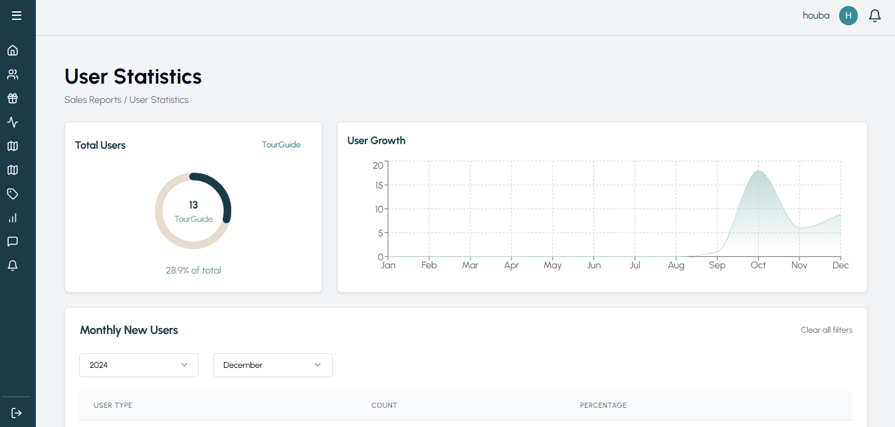
</p>
</details>

<details>
<summary>Change Password Page</summary>
<p align="center">
  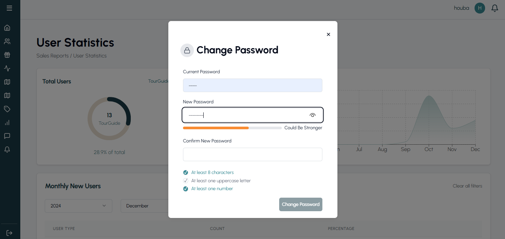
</p>
</details>

<details>
<summary>Customer Support Page</summary>
<p align="center">
  
</p>
</details>

<details>
<summary>Wallet Balance Overview</summary>
<p align="center">
  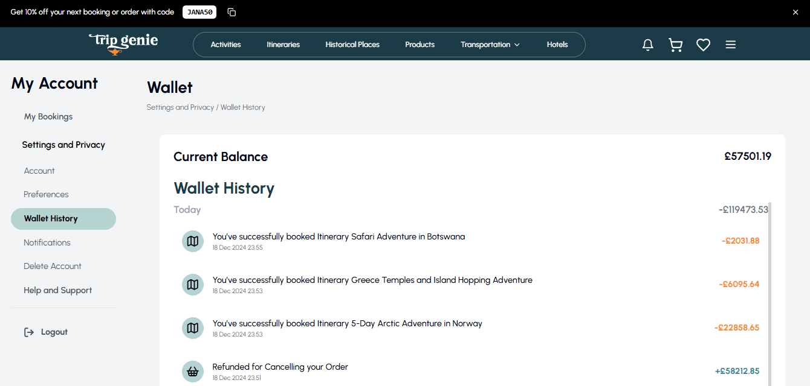
</p>
</details>

<details>
<summary>Booking Receipt for Completed Itineraries</summary>
<p align="center">
  
</p>
</details>

<details>
<summary>Tourist Orders Page</summary>
<p align="center">
  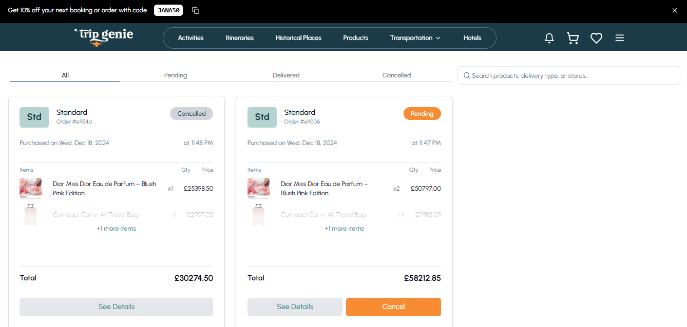
</p>
</details>

<details>
<summary>Shopping Cart</summary>
<p align="center">
  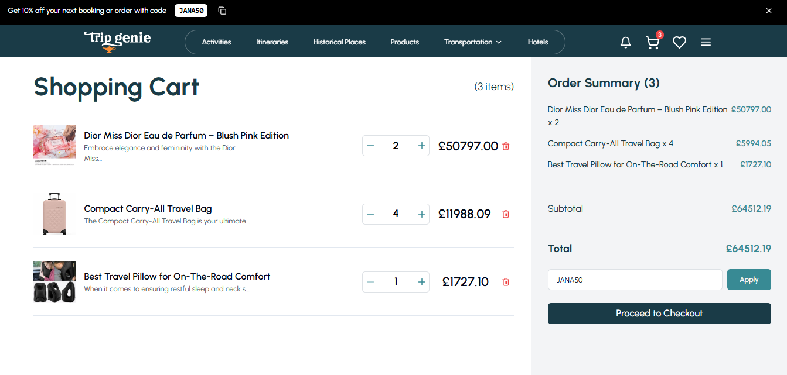
</p>
</details>

<details>
<summary>Checkout Page</summary>
<p align="center">
  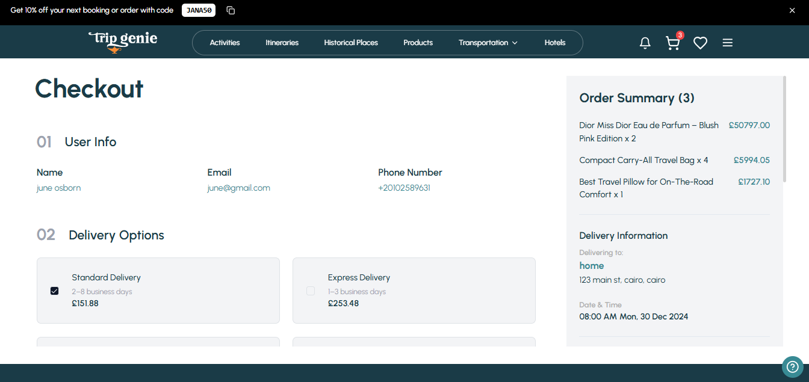
</p>
</details>

## Tech/Framework Used

### Built With

- React 18 with Vite
- JavaScript
- Tailwind CSS
- MongoDB
- Node.js
- Express.js

### Key Libraries

- js-cookie for authentication
- axios for API requests
- lucide-react for icons
- cloudinary for image storing and uploading
- stripe for payment handling

## Features

### For Guests / Tourists

- **View Activities**: Browse all activities along with their prices, ratings, current offers, and discounts.
- **Advertiser Details**: See information about the activity advertiser, including their reviews and ratings.
- **Filter Activities**: Narrow down activities by price, date range, ratings, categories, or by searching within activities.
- **Sort Activities**: Organize activities by ratings, price, or personal preferences (especially useful for tourists).

- **View Itineraries**: Explore all itineraries, including available dates, ratings, and reviews.
- **Tour Guide Info**: Access details about the tour guide, such as their ratings and reviews.
- **Filter Itineraries**: Refine itineraries based on price, date range, type, language, or by searching within itineraries.
- **Sort Itineraries**: Arrange itineraries by ratings, price, or personal preferences (especially useful for tourists).

- **View Historical Places**: Discover historical places and their entry prices.
- **Filter Historical Places**: Filter historical places by type or by searching within them.

- **Browse Gift Shop**: Explore the gift shop with a range of travel-related products, filtering by price or rating.
- **Sort Products**: Sort products by rating, price, or search for specific items.

- **View Legal Information**: Access the FAQ, Terms and Conditions, and Privacy Policy.
- **Contact Us**: Reach out using the information provided in the contact section.

### For Tourists

- **Login**: Login using username and password.
- **Forget password**: Forget password using an OTP sent to email.
- **Manage profile**: View my profile, edit my profile details, delete account, change password and currency.

- **Manage wallet**: View my wallet, previous wallet transactions and redeem loyalty points for wallet money.

- **Loyalty points**: Receive loyalty points upon payment for any event/itinerary.
- **Delete account**: Request account to be deleted off the system.
- **Joyride**: View a step-by-step guide on the steps I must take in order to begin a vacation.
- **Select preferences**: Select preferences for a vacation.
- **Booking**: Book flights, hotels, transportation, itineraries or activities.

- **Cancel booking**: Cancel booking and view refunded money in wallet.
- **Share events**: Share an acitivity, historical places or itinerary via copy link or email.
- **Rate/comment**: Rate/comment on tourguides, itineraries and activities attended or products purchased.
- **Payment**: Pay online for an event using credit card/debit card or from wallet.
- **Save**: Bookmark events so to view them later.
- **Manage wishlist**: View, add and remove from my wishlist of products.
- **Manage cart**: Add, remove and change number of items of a product in cart.
- **Manage notifications**: View notifications and mark them as read.
- **Complaints**: File a complaint and view a list of my complaints.
- **Checkout**: Checkout order and choose delivery address and payment type and use promocode if applicable.

- **View orders**: View a list of orders and each order details and status.
- **Cancel order**: Cancel order and view refunded money in wallet.

### For Tour Guides

- **View All Itineraries**: View all itinerary details including price, description, duration, and rating.
- **Filter All Itineraries**: Filter itineraries by price, duration, and rating to ease navigation.
- **Search for a specific itinerary**: Search for an itinerary by its title, destination, or description.
- **Sort itineraries**: Sort itineraries by price, duration, or rating to ease navigation.
- **Manage my itineraries**: Create, update, delete, activate, and deactivate my itineraries.
- **View bookings and revenue of itineraries**: View a detailed report including each itinerary, its bookings, and revenue after commission.
- **Filter itineraries in reports**: Filter itineraries by title, and dates to ease navigation.
- **Manage my profile**: View my profile, edit my profile details, delete account, and change my password.
- **Manage my notifications**: View my notifications and mark them as read.
- **View my reviews**: Access and review feedback provided by tourists, including ratings and detailed comments, after attending a trip.
- **View Legal Information**: Access the FAQ, Terms and Conditions, and Privacy Policy.

### For Sellers

- **View All products**: View all products detials including price , description , quantity and rating.
- **Filter All products**: Filter products avaialble by price and rating to ease my navigation.
- **Search for a specific product**: Search for a product by its name or description.
- **Sort products**: Sort products by rating and price to ease my navigation.
- **Manage my products**: update , delete , archive, unarchive my products.
- **View Sales and revenue of products**: view a detailed sales report including each product , its sales , revenue and revenue after commission.
- **View products stock report**: View a detailed stock report including each product , its sales , and quantity left in stock.
- **Filter products in reports**: Filter the products by product name and year to ease navigation.
- **Manage my profile**: View my profile , edit my profile details , delete account , change my password.
- **Manage my notifications** View my notifications and mark them as read.
- **View Legal Information**: Access the FAQ, Terms and Conditions, and Privacy Policy.
- **Contact Us**: Reach out using the information provided in the contact section.

### For Advertisers

- **View All Activities:** View all activity details, including price, description, location, and rating.
- **Filter All Activities:** Filter activities by price, date, rating and category to ease navigation.
- **Search for a Specific Activity:** Search for an activity by its title or description.
- **Sort Activities:** Sort activities by price or/and rating ease navigation.
- **Manage My Activities:** Create, update, delete, activate, and deactivate my activities.
- **View Bookings and Revenue of Activities:** View a detailed report including each activity, its bookings, and revenue after commission.
- **Filter Activities in Reports:** Filter activities by title and dates to ease navigation.
- **Manage My Profile:** View my profile, edit my profile details, delete account, and change my password.
- **Manage My Notifications:** View my notifications and mark them as read.
- **View My Reviews:** Access and review feedback provided by users, including ratings and detailed comments, after attending an activity.
- **View Legal Information:** Access the FAQ, Terms and Conditions, and Privacy Policy.

### For Tourism Governors

- **View All Historical Places:** Navigate to the "Historical Places" dropdown in the navbar and select "All Historical Places" to explore all the historical places available on the platform.

- **Create New Historical Places:** Add new historical places by selecting "Create Historical Place" from the Historical Places dropdown in the navbar.

- **Manage Historical Places:** Access "My Historical Places" from the Historical Places dropdown in the navbar where you can:

  - Edit existing places
  - Update information
  - Delete outdated entries

- **Create Historical Tags:** Create and maintain historical tags through the "Historical Tags" section in the navbar to add new tags

- **Search and Filtering:** Utilize the platform's advanced search features:
  - Filter by historical place type
  - Search by name or location
  - Filter by ticket price range

### For Admins

- **View Registration Documents**: Browse documents uploaded by tour guides, advertisers, and sellers during registration.
- **Approve/Reject Registrations**: Accept or reject tour guides, advertisers, and sellers based on their uploaded documents.

- **Delete Accounts**: Remove accounts from the system.
- **Add Admin or Tourism Governor**: Create a new Admin or Tourism Governor account

- **View Sales Report**: Access detailed revenue reports from events, itineraries, and gift shop sales.
- **Filter Sales Reports**: Narrow down reports by product, date, or month.
- **Manage Activity Categories**: Manage categories for activities.

- **Manage Preference Tags**: Manage tags like beaches or family-friendly options.
- **Flag Events/Itineraries**: Mark events or itineraries as inappropriate.
- **View User Statistics**: See total users and page visits per day.
- **View Complaints**: Browse all complaints with their statuses (pending/resolved).
- **Complaint Details**: Access detailed information about selected complaints.
- **Manage Complaints**: Mark complaints as pending or resolved, reply to complaints, and sort/filter them by date or status.

- **View Products**: See product details, including available quantity, sales, and ratings.
- **Search Products**: Find products by name.
- **Filter and Sort Products**: Narrow down products by price or ratings.
- **Add New Products**: Add products with details, price, quantity, and images.
- **Manage Product Details**: Manage product details, price, or quantity.
- **Archive/Unarchive Products**: Temporarily hide or restore products.

- **Stock Notifications**: Receive system and email alerts when a product is out of stock.

- **Create Promo Codes**: Generate discount codes for use in the system.

## Installation

1. Clone the repository:

```bash
git clone https://github.com/Advanced-computer-lab-2024/Trip-Genie.git
```

2. Install dependencies:

```bash
cd TripGenie
cd frontend
npm install
cd ..
cd backend
npm install
```

3. Set up environment variables:

```
MONGODB_URI= ...
JWT_SECRET= ...
STRIPE_KEY= ...
STRIPE_PRIVATE_KEY = ...
CLOUDINARY_API_KEY = ...
CLOUDINARY_API_SECRET = ...
VITE_AMADEUS_API_SECRET = ...
VITE_STRIPE_PUBLISHABLE_KEY = ...
```

4. Run the development server:

```bash
cd Trip-Genie/frontend
npm run dev
```

```bash
cd Trip-Genie/backend
npm run dev
```

## API Reference

External APIs used:

https://developers.amadeus.com/self-service/category/flights

https://docs.stripe.com/api

https://developers.booking.com/metasearch/connect-api

Local APIs

You can view all our APIs from the [routes](./backend/routes) folder in the backend.

## Common Routes for All Roles

Note: {role} can be: tourist, advertiser, tour-guide, tourism-governor, seller, admin

1. Get Supported Currencies

   - Endpoint: GET /{role}/currencies
   - Description: Returns a list of supported currencies.

2. Get Currency by ID

   - Endpoint: GET /{role}/getCurrency/:id
   - Description: Returns currency details by ID.

3. Get Profile

   - Endpoint: GET /{role}/
   - Description: Returns the profile of the logged-in {role}.

4. Update Profile (Where applicable)

   - Endpoint: PUT /{role}/
   - Description: Updates the profile of the logged-in {role}.

5. Get All Activities/Products/Historical Places

   - Endpoint: GET /{role}/activities (or equivalent resource name for each role)
   - Description: Returns a list of all activities/products/historical places for the logged-in {role}.

6. Get Activity/Product/Place by ID

   - Endpoint: GET /{role}/activities/:id (or equivalent resource name for each role)
   - Description: Returns details of a specific activity/product/place by ID.

7. Get Notifications

   - Endpoint: GET /{role}/notifications
   - Description: Returns a list of notifications for the {role}.

8. Get Unseen Notifications

   - Endpoint: GET /{role}/unseen-notifications
   - Description: Returns a list of unseen notifications for the {role}.

9. Mark Notification as Seen

   - Endpoint: PUT /{role}/notifications/markAsSeen/:id
   - Description: Marks a specific notification as seen for the {role}.

10. Mark Dropdown as Opened
    - Endpoint: PUT /{role}/mark-dropdown-opened
    - Description: Marks the notification dropdown as opened for the {role}.

## Role-Specific Routes

### Tourist Routes

11. Cancel Flight Booking

    - Endpoint: POST /tourist/cancel-flight/:id
    - Description: Cancels a flight booking and returns the refunded amount and new wallet balance.

12. Get All Products

    - Endpoint: GET /tourist/products
    - Description: Returns a list of all products.

13. Get Product by ID

    - Endpoint: GET /tourist/products/:id
    - Description: Returns details of a specific product by ID.

14. Add Product to Cart

    - Endpoint: POST /tourist/product/addToCart
    - Description: Adds a product to the cart.

15. Add Product to Wishlist

    - Endpoint: POST /tourist/product/addToWishlist/:id
    - Description: Adds a product to the wishlist.

16. Rate Product

    - Endpoint: POST /tourist/product/rate/:id
    - Description: Rates a product.

17. Comment on Product

    - Endpoint: POST /tourist/product/comment/:id
    - Description: Adds a comment to a product.

18. Update Comment on Product

    - Endpoint: PUT /tourist/product/updateComment/:id
    - Description: Updates a comment on a product.

19. Get All Activities

    - Endpoint: GET /tourist/activities
    - Description: Returns a list of all activities.

20. Get Activity by ID

    - Endpoint: GET /tourist/activities/:id
    - Description: Returns details of a specific activity by ID.

21. Rate Activity

    - Endpoint: POST /tourist/activities/rate/:id
    - Description: Rates an activity.

22. Comment on Activity

    - Endpoint: POST /tourist/activities/comment/:id
    - Description: Adds a comment to an activity.

23. Update Comment on Activity

    - Endpoint: PUT /tourist/activities/updateComment/:id
    - Description: Updates a comment on an activity.

24. Get All Itineraries

    - Endpoint: GET /tourist/itineraries
    - Description: Returns a list of all itineraries.

25. Get Itinerary by ID

    - Endpoint: GET /tourist/itineraries/:id
    - Description: Returns details of a specific itinerary by ID.

26. Rate Itinerary

    - Endpoint: POST /tourist/itinerary/rate/:id
    - Description: Rates an itinerary.

27. Comment on Itinerary

    - Endpoint: POST /tourist/itinerary/comment/:id
    - Description: Adds a comment to an itinerary.

28. Update Comment on Itinerary

    - Endpoint: PUT /tourist/itinerary/updateComment/:id
    - Description: Updates a comment on an itinerary.

29. Get All Historical Places

    - Endpoint: GET /tourist/historical-places
    - Description: Returns a list of all historical places.

30. Get Historical Place by ID

    - Endpoint: GET /tourist/historical-places/:id
    - Description: Returns details of a specific historical place by ID.

31. Book Transportation

    - Endpoint: POST /tourist/book-transportation
    - Description: Books transportation.

32. Get Upcoming Transportation Bookings

    - Endpoint: GET /tourist/upcoming-transportation
    - Description: Returns a list of upcoming transportation bookings.

33. Get Previous Transportation Bookings

    - Endpoint: GET /tourist/history-transportation
    - Description: Returns a list of previous transportation bookings.

34. Delete Transportation Booking

    - Endpoint: DELETE /tourist/transportation-booking/:id
    - Description: Deletes a transportation booking.

35. Book Flight

    - Endpoint: POST /tourist/book-flight
    - Description: Books a flight.

36. Cancel Flight Booking

    - Endpoint: POST /tourist/cancel-flight/:id
    - Description: Cancels a flight booking.

37. Get My Flights

    - Endpoint: GET /tourist/my-flights
    - Description: Returns a list of the tourist's flights.

38. Book Hotel

    - Endpoint: POST /tourist/book-hotel
    - Description: Books a hotel.

39. Cancel Hotel Booking

    - Endpoint: POST /tourist/cancel-hotel/:id
    - Description: Cancels a hotel booking.

40. Get My Hotels

    - Endpoint: GET /tourist/my-hotels
    - Description: Returns a list of the tourist's hotels.

41. Apply Promo Code

    - Endpoint: POST /tourist/promo-code
    - Description: Applies a promo code.

42. Get Promo Code

    - Endpoint: POST /tourist/get/promo-code
    - Description: Retrieves a promo code.

43. Get Promo Codes

    - Endpoint: GET /tourist/promo-codes
    - Description: Returns a list of promo codes.

44. Save Activity

    - Endpoint: POST /tourist/save-activity/:id
    - Description: Saves an activity.

45. Save Itinerary

    - Endpoint: POST /tourist/save-itinerary/:id
    - Description: Saves an itinerary.

46. Get Saved Activities

    - Endpoint: GET /tourist/saved-activities
    - Description: Returns a list of saved activities.

47. Get Saved Itineraries

    - Endpoint: GET /tourist/saved-itineraries
    - Description: Returns a list of saved itineraries.

48. Get Visited Pages

    - Endpoint: GET /tourist/visited-pages
    - Description: Returns a list of visited pages.

49. Update Visited Pages
    - Endpoint: POST /tourist/visited-pages
    - Description: Updates the list of visited pages.

### Advertiser Routes

50. Create Activity

    - Endpoint: POST /advertiser/activities
    - Description: Creates a new activity.

51. Get All Activities

    - Endpoint: GET /advertiser/activities
    - Description: Returns a list of all activities.

52. Get Activity by ID

    - Endpoint: GET /advertiser/activities/:id
    - Description: Returns details of a specific activity by ID.

53. Update Activity

    - Endpoint: PUT /advertiser/activities/:id
    - Description: Updates an existing activity by ID. Supports file uploads.

54. Delete Activity

    - Endpoint: DELETE /advertiser/activities/:id
    - Description: Deletes an activity by ID.

55. Get Max Price Activities

    - Endpoint: GET /advertiser/maxPriceActivities
    - Description: Returns the maximum price of activities.

56. Get Max Price Activities (My)

    - Endpoint: GET /advertiser/max-price-activities-my
    - Description: Returns the maximum price of the advertiser's activities.

57. Get All Transportations

    - Endpoint: GET /advertiser/transportations
    - Description: Returns a list of all transportations.

58. Get Transportation by ID

    - Endpoint: GET /advertiser/transportations/:id
    - Description: Returns details of a specific transportation by ID.

59. Create Transportation

    - Endpoint: POST /advertiser/transportations
    - Description: Creates a new transportation.

60. Update Transportation

    - Endpoint: PUT /advertiser/transportations/:id
    - Description: Updates an existing transportation by ID.

61. Delete Transportation

    - Endpoint: DELETE /advertiser/transportations/:id
    - Description: Deletes a transportation by ID.

62. Get Activities Report
    - Endpoint: GET /advertiser/activities-report
    - Description: Retrieves a report of activities and their bookings.

### Seller Routes

63. Get All Products

    - Endpoint: GET /seller/products
    - Description: Returns a list of all products.

64. Get Product by ID

    - Endpoint: GET /seller/products/:id
    - Description: Returns details of a specific product by ID.

65. Add New Product

    - Endpoint: POST /seller/products
    - Description: Adds a new product. Supports file uploads.

66. Edit Product

    - Endpoint: PUT /seller/products/:id
    - Description: Edits an existing product by ID. Supports file uploads.

67. Delete Product

    - Endpoint: DELETE /seller/products/:id
    - Description: Deletes a product by ID.

68. Archive Product

    - Endpoint: PUT /seller/archiveproducts/:id
    - Description: Archives a product by ID.

69. Get Sales Report

    - Endpoint: GET /seller/sales-report
    - Description: Retrieves the sales report for the seller.

70. Get Stock Report
    - Endpoint: GET /seller/stock-report
    - Description: Retrieves the stock report for the seller.

### Tourism Governor Routes

71. Create Historical Place

    - Endpoint: POST /tourism-governor/historical-places
    - Description: Creates a new historical place.

72. Get Historical Tags

    - Endpoint: GET /tourism-governor/historical-tag
    - Description: Returns a list of all historical tags.

73. Add/Update/Delete Historical Tag
    - Endpoints:
      - POST: /tourism-governor/historical-tag (Add a tag)
      - PUT: /tourism-governor/historical-tag/:id (Update a tag by ID)
      - DELETE: /tourism-governor/historical-tag/:id (Delete a tag by ID)

## Auth Routes

74. Tourist Signup

    - Endpoint: POST /auth/sign-up/tourist
    - Description: Registers a new tourist.

75. Advertiser Signup

    - Endpoint: POST /auth/sign-up/advertiser
    - Description: Registers a new advertiser.

76. Tour Guide Signup

    - Endpoint: POST /auth/sign-up/tour-guide
    - Description: Registers a new tour guide.

77. Seller Signup

    - Endpoint: POST /auth/sign-up/seller
    - Description: Registers a new seller.

78. Check Unique

    - Endpoint: POST /auth/check-unique
    - Description: Checks if a username or email is unique.

79. Login/Logout

    - Endpoints:
      - POST: /auth/login (Login the user)
      - POST: /auth/logout (Logout the user)

80. Forgot/Reset Password

    - Endpoints:
      - POST: /auth/forgot-password (Sends a password reset link to the user's email)
      - POST: /auth/reset-password (Resets the user's password)

81. Verify OTP
    - Endpoint: POST /auth/verify-otp
    - Description: Verifies the OTP sent to the user's email.

## API Routes

82. Get All Nationalities/Tags/Categories/Historical Types/Languages
    - Endpoints:
      - GET: /api/nationalities (All nationalities)
      - GET: /api/getAllTags (All tags)
      - GET: /api/getAllCategories (All categories)
      - GET: /api/getAllHistoricalTypes (All historical types)
      - GET: /api/getAllLanguages (All languages)

## Admin Routes

83. Promo Code Management

    - Endpoints:
      - POST: /admin/promo-code (Add promo code)
      - GET: /admin/promo-code (Get all promo codes)
      - GET: /admin/promo-code/:id (Get promo code by ID)
      - PUT: /admin/promo-code/:id (Update promo code by ID)
      - DELETE: /admin/promo-code/:id (Delete promo code by ID)

84. Get Max Price Activities

    - Endpoint: GET /admin/maxPriceActivities
    - Description: Returns the maximum price of activities.

85. Admin Info
    - Endpoint: GET /admin/admin-info
    - Description: Returns the profile of the logged-in admin.

## Tests

Run the test suite:

```bash
cd backend
npm run test
```

Here's an example of how to test the `GET /itinerary` endpoint:

```javascript
test("GET /itinerary", async () => {
  const response = await request(app).get("/itinerary");
  expect(response.statusCode).toBe(200);
  expect(response.body).toStrictEqual([]);
});
```

<details><summary>
  Here are our test cases that will run with npm run test:
</summary>

Test 1: Get Tourist Profile

Description:
This test verifies that a tourist can successfully retrieve their profile information.

Code:

```javascript
test("GET /tourist - should get tourist profile", async () => {
  const res = await request(app).get("/tourist").set("user_id", testTouristId);
  expect(res.statusCode).toBe(200);
  expect(res.body.username).toBe("testuser");
});
```

Test 2: Update Tourist Profile

Description:
This test ensures that a tourist can update their profile information successfully.

Code:

```javascript
test("PUT /tourist - should update tourist profile", async () => {
  const res = await request(app)
    .put("/tourist")
    .set("user_id", testTouristId)
    .send({
      username: "updateduser",
      email: "updated@example.com",
      jobOrStudent: "Professional",
      nationality: testNationalityId,
      mobile: "+9876543210987",
    });
  expect(res.statusCode).toBe(200);
  expect(res.body.username).toBe("updateduser");
});
```

Test 3: Update Tourist Preferences

Description:
This test verifies that a tourist can update their preferences successfully.

Code:

```javascript
test("PUT /tourist/preferences - should update tourist preferences", async () => {
  const res = await request(app)
    .put("/tourist/preferences")
    .set("user_id", testTouristId)
    .send({ budget: 1000, categories: ["adventure", "culture"] });
  expect(res.statusCode).toBe(200);
  expect(res.body.preference.budget).toBe(1000);
});
```

Test 4: Get Tourist Cart

Description:
This test ensures that a tourist can retrieve their cart contents successfully.

Code:

```javascript
test("GET /tourist/cart - should get tourist cart", async () => {
  const res = await request(app)
    .get("/tourist/cart")
    .set("user_id", testTouristId);
  expect(res.statusCode).toBe(200);
  expect(Array.isArray(res.body)).toBeTruthy();
});
```

Test 5: Empty Tourist Cart

Description:
This test verifies that a tourist can empty their cart successfully.

Code:

```javascript
test("DELETE /tourist/empty/cart - should empty tourist cart", async () => {
  const res = await request(app)
    .delete("/tourist/empty/cart")
    .set("user_id", testTouristId);
  expect(res.statusCode).toBe(200);
  expect(res.body.message).toBe("Cart emptied");
});
```

Test 6: Get Tourist Wishlist

Description:
This test ensures that a tourist can retrieve their wishlist successfully.

Code:

```javascript
test("GET /tourist/wishlist - should get tourist wishlist", async () => {
  const res = await request(app)
    .get("/tourist/wishlist")
    .set("user_id", testTouristId);
  expect(res.statusCode).toBe(200);
  expect(Array.isArray(res.body)).toBeTruthy();
});
```

Test 7: Remove Product from Wishlist

Description:
This test verifies that a tourist can remove a product from their wishlist successfully.

Code:

```javascript
test("DELETE /tourist/remove/wishlist/:id - should remove product from wishlist", async () => {
  const product = new Product({ name: "Test Product", price: 100 });
  await product.save();
  await Tourist.findByIdAndUpdate(testTouristId, {
    $push: { wishlist: { product: product._id } },
  });

  const res = await request(app)
    .delete(`/tourist/remove/wishlist/${product._id}`)
    .set("user_id", testTouristId);
  expect(res.statusCode).toBe(200);
  expect(res.body.message).toBe("Product removed from wishlist");
});
```

Test 8: Move Product from Wishlist to Cart

Description:
This test ensures that a tourist can move a product from their wishlist to their cart successfully.

Code:

```javascript
test("PUT /tourist/move/wishlist/:id - should move product from wishlist to cart", async () => {
  const product = new Product({ name: "Test Product", price: 100 });
  await product.save();
  await Tourist.findByIdAndUpdate(testTouristId, {
    $push: { wishlist: { product: product._id } },
  });

  const res = await request(app)
    .put(`/tourist/move/wishlist/${product._id}`)
    .set("user_id", testTouristId);
  expect(res.statusCode).toBe(200);
  expect(res.body.message).toBe("Product moved to cart");
});
```

Test 9: Get Currency Code

Description:
This test verifies that a tourist can retrieve their preferred currency code successfully.

Code:

```javascript
test("GET /tourist/currencies/code - should get currency code", async () => {
  const currency = new Currency({ code: "USD", name: "US Dollar" });
  await currency.save();
  await Tourist.findByIdAndUpdate(testTouristId, {
    preferredCurrency: currency._id,
  });

  const res = await request(app)
    .get("/tourist/currencies/code")
    .set("user_id", testTouristId);
  expect(res.statusCode).toBe(200);
  expect(res.body).toBe("USD");
});
```

Test 10: Set Currency Code

Description:
This test ensures that a tourist can set their preferred currency successfully.

Code:

```javascript
test("POST /tourist/currencies/set - should set currency code", async () => {
  const currency = new Currency({ code: "EUR", name: "Euro" });
  await currency.save();

  const res = await request(app)
    .post("/tourist/currencies/set")
    .set("user_id", testTouristId)
    .send({ currencyId: currency._id });
  expect(res.statusCode).toBe(200);
  expect(res.body.currencyCode).toBe("EUR");
});
```

Test 11: Add New Card

Description:
This test verifies that a tourist can add a new payment card successfully.

Code:

```javascript
test("PUT /tourist/add-card - should add a new card", async () => {
  const res = await request(app)
    .put("/tourist/add-card")
    .set("user_id", testTouristId)
    .send({
      cardType: "Credit Card",
      cardNumber: "1234567890123456",
      expiryDate: "12/25",
      holderName: "Test User",
      cvv: "123",
    });
  expect(res.statusCode).toBe(200);
  expect(res.body.message).toBe("Card added successfully");
});
```

Test 12: Get All Cards

Description:
This test ensures that a tourist can retrieve all their saved cards successfully.

Code:

```javascript
test("GET /tourist/cards - should get all cards", async () => {
  const res = await request(app)
    .get("/tourist/cards")
    .set("user_id", testTouristId);
  expect(res.statusCode).toBe(200);
  expect(Array.isArray(res.body.cards)).toBeTruthy();
});
```

Test 13: Add New Shipping Address

Description:
This test verifies that a tourist can add a new shipping address successfully.

Code:

```javascript
test("PUT /tourist/add-shippingAdd - should add a new shipping address", async () => {
  const res = await request(app)
    .put("/tourist/add-shippingAdd")
    .set("user_id", testTouristId)
    .send({
      streetName: "Test Street",
      streetNumber: "123",
      city: "Test City",
      state: "Test State",
      country: "Test Country",
    });
  expect(res.statusCode).toBe(200);
  expect(res.body.message).toBe("Address added successfully");
});
```

Test 14: Get All Shipping Addresses

Description:
This test ensures that a tourist can retrieve all their saved shipping addresses successfully.

Code:

```javascript
test("GET /tourist/shippingAdds - should get all shipping addresses", async () => {
  const res = await request(app)
    .get("/tourist/shippingAdds")
    .set("user_id", testTouristId);
  expect(res.statusCode).toBe(200);
  expect(Array.isArray(res.body.shippingAddresses)).toBeTruthy();
});
```

Test 15: Redeem Loyalty Points

Description:
This test verifies that a tourist can redeem their loyalty points successfully.

Code:

```javascript
test("POST /tourist/redeem-points - should redeem loyalty points", async () => {
  await Tourist.findByIdAndUpdate(testTouristId, { loyaltyPoints: 10000 });

  const res = await request(app)
    .post("/tourist/redeem-points")
    .set("user_id", testTouristId);
  expect(res.statusCode).toBe(200);
  expect(res.body.message).toContain("Successfully redeemed");
});
```

Test 16: Change Password

Description:
This test ensures that a tourist can change their password successfully.

Code:

```javascript
test("POST /tourist/password - should change password", async () => {
  const res = await request(app)
    .post("/tourist/password")
    .set("user_id", testTouristId)
    .send({ oldPassword: "Password123!", newPassword: "NewPassword123!" });
  expect(res.statusCode).toBe(200);
  expect(res.body.message).toBe("Password updated successfully");
});
```

Test 17: Add New Complaint

Description:
This test verifies that a tourist can submit a new complaint successfully.

Code:

```javascript
test("POST /tourist/complaint - should add a new complaint", async () => {
  const res = await request(app)
    .post("/tourist/complaint")
    .set("user_id", testTouristId)
    .send({ title: "Test Complaint", description: "This is a test complaint" });
  expect(res.statusCode).toBe(200);
  expect(res.body.message).toBe("Complaint added successfully");
});
```

Test 18: Get All Complaints

Description:
This test ensures that a tourist can retrieve all their submitted complaints successfully.

Code:

```javascript
test("GET /tourist/complaints - should get all complaints", async () => {
  const res = await request(app)
    .get("/tourist/complaints")
    .set("user_id", testTouristId);
  expect(res.statusCode).toBe(200);
  expect(Array.isArray(res.body)).toBeTruthy();
});
```

Test 19: Delete Tourist Account

Description:
This test verifies that a tourist can delete their account successfully.

Code:

```javascript
test("DELETE /tourist/delete-account - should delete tourist account", async () => {
  const res = await request(app)
    .delete("/tourist/delete-account")
    .set("user_id", testTouristId);
  expect(res.statusCode).toBe(200);
  expect(res.body.message).toBe("Account deleted successfully");
});
```

</details>

Test examples using postman:


Postman Collection link with 20 more tests: [Postman Collection Link](https://sam-and-aby.postman.co/workspace/Sam-and-Aby-Workspace~71afcd01-1885-4c49-8c9e-9f419f489cae/collection/38513772-4b45eeb0-aff2-457b-aa8e-8c278217d4bd?action=share&creator=38513772)

Link to the exported collections with the test scripts: [Exported Collection](./Tests.postman_collection.json)

## How to Use

### General summary of how to use the website

1. Sign up for an account based on your role (Tourist, Tour Guide, Seller, etc.) or browse as a guest
2. Complete your profile and verify your account
3. Explore the platform features based on your role:
   - Tourists can browse and book activities
   - Tour Guides can create itineraries
   - Sellers can list products
   - Tourism Governors can manage historical places
   - Advertisers can create activities

### Detailed steps for each role

#### For Tourists

1. **Sign Up:**

   - Create an account as a Tourist by providing your details.

2. **As a Trip Genie Tourist, you gain access to the following features:**

   - **View All Activities:** Select "Activities" in the navbar to explore all the Activities available on the platform.

   - **View All Itineraries:** Select "Itineraries" in the navbar to explore all the Itineraries available on the platform.

   - **View All Historical Places:** Select "Historical Places" in the navbar to explore all the Historical Places available on the platform.

   - **View All Products:** Select "Products" in the navbar to explore all the Products available on the platform.

   - **View Available Vehicles:** Navigate to the "Transportation" dropdown in the navbar and select "Vehicles" to explore all the available Vehicles that you could book.

   - **View Flights:** Navigate to the "Transportation" dropdown in the navbar and select "Flights" to be able to access available flights.

   - **View Hotels:** Select "Hotels" in the navbar to explore all the Hotels available on the platform.

   - **View your notifications:** You can view your notifications from the bell icon in the navbar which alert you about different situations like successful booking and you can mark them as read, you can navigate to all notifications page to view all notifications.

   - **View your Cart:** Quickly view and manage the items you’ve added by clicking the cart icon located in the top-right of the navbar

   - **View your Wishlist:** Quickly view and manage the items you’ve added by clicking the heart icon located in the top-right of the navbar

   - **Manage profile settings:** To view and manage your preferences, wallet, wallet history, redeem loyalty points and notifications, click on the burger button (☰) at the top right corner of the navbar. Once clicked, select the 'My Account' tab.

   - **Get Assistance and Resolve Issues:** Under the 'Help and Support' tab, accessible by clicking the burger button (☰) at the top right corner of the navbar, you can view the FAQs for common queries or submit complaints for further assistance.

   - **Manage your orders:** You can access your orders (pending, delivered, cancelled) by clicking the burger button (☰) at the top right corner of the navbar, then selecting 'Orders' from the menu.

   - **View Details of Itinerary/Activity/Historical Place/Products:** You can easily access all details about a certain itinerary/activity/historical place by pressing its card from its corresponding general page.

   - **Book an Itinerary/Activity:** You can book an Itinerary/Activity by accessing the Itinerary/Activity detailed page then pressing the book button.

   - **Save/Unsave an Itinerary/Activity:** You can Save/Unsave an Itinerary/Activity by accessing the Itinerary/Activity detailed page then pressing the Save/Unsave button.

   - **Rate and Review an Itinerary/Activity:** You can Rate and Review an attended Itinerary/Activity by accessing the Itinerary/Activity detailed page then pressing the Rate and Review button.

   - **Add to Cart:** To add a product to your cart, access the product details page and click the 'Add to Cart' button.

   - **Add to Wishlist:** To add a product to your Wishlist, access the product details page and click the 'Add to Wishlist' button.

   - **Rate and Review a Product:** You can Rate and Review a purchased Product by accessing the Product detailed page then pressing the Rate and Review button.

   - **Proceed to checkout:** To proceed to checkout, access your cart and click the 'Proceed to Checkout' button.

   - **Access and Rate past bookings:** You can view and rate your past bookings by clicking the burger button (☰) at the top right corner, then selecting 'My Account' and then pressing 'My Bookings'.

   - **Enhanced Search and Filtering:** Utilize the platform’s Search, Filter, and Sort features to quickly find and manage the information you need.

#### For Tour Guides

1. **Sign Up:**

   - Create an account as a Tour Guide by providing your details.
   - Ensure you upload the required documents: ID and Taxation Registry Card.

2. **Account Approval:**

   - Wait for an Admin to review your submitted documents. Once verified, your account will be approved, and you can start using the platform.

3. **As a Trip Genie Tour Guide, you gain access to the following features:**

   - **View All Itineraries:** Navigate to the "Itineraries" dropdown in the navbar and select "All Itineraries" to explore all the itineraries available on the platform.

   - **Create New Itineraries:** Add new itineraries that other users can view and buy by selecting "Create Itinerary" from the Itineraries dropdown in the navbar.

   - **Manage Your Itineraries:** To view and manage the itineraries you’ve created, go to the "My Itineraries" from the Itineraries dropdown in the navbar where you can edit, update and activate/deactivate your itineraries.

   - **View Sales Report:** Stay updated on your performance by checking "Sales Report" in the navbar. This section provides insights into sales and revenue generated by your itineraries.

   - **View your notifications:** You can view your notifications from the bell icon in the navbar which alert you about different situations like itineray being flagged as inappropriate and you can mark them as read, you can navigate to all notificaions page to view all notifications.

   - **View your Account status:** you can view your account details, edit your profile and change your password from the settings and privacy tab in my account, also you can click on Help and Support to view the FAQs.

   - **View Feedback:** you can access and review feedback provided by tourists, including ratings and detailed comments from the settings and privacy tab in my account.

   - **Delete your Account:** you can permanently delete your account from the settings and privacy tab in delete account, all your booked itineraries will be deactivated and can no longer be booked.

   - **Enhanced Search and Filtering:** Utilize the platform’s Search, Filter, and Sort features to quickly find and manage the information you need.

#### For Sellers

1. **Sign Up:**

   - Create an account as a Seller by providing your details.
   - Ensure you upload the required documents: ID and Taxation Registry Card.

2. **Account Approval:**

   - Wait for an Admin to review your submitted documents. Once verified, your account will be approved, and you can start using the platform.

3. **As a Trip Genie Seller, you gain access to the following features:**

   - **View All Products:** Navigate to the "Products" dropdown in the navbar and select "All Products" to explore all the products available on the platform.

   - **Create New Products:** Add new products that other users can view and buy by selecting "Create Product" from the Products dropdown in the navbar.

   - **Manage Your Products:** To view and manage the products you’ve created, go to the "My Products" from the Products dropdown in the navbar where you can archive your products.

   - **View your Archived Products** To view and manage the products you’ve archived and unarchive them if you wish, go to the "Archived Products" from the Products dropdown in the navbar.

   - **View Sales Report:** Stay updated on your performance by checking "Sales Report" in the navbar. This section provides insights into sales and revenue generated by your products.

   - **View Stock Report:** Stay updated on your performance by checking "Stock Report" in the navbar. This section provides insights into sales generated by your products and the quantity left in stock for each product.

   - **View your notifications:** You can view your notifications from the bell icon in the navbar which alert you about different situations like product being out of stock and you can mark them as read, you can navigate to all notificaions page to view all notifications.

   - **View your Account status:** you can view your account details, edit your profile and change your password from the settings and privacy tab in my account, also you can click on Help and Support to view the FAQs.

   - **Enhanced Search and Filtering:** Utilize the platform’s Search, Filter, and Sort features to quickly find and manage the information you need.

#### For Advertisers

1. **Sign Up:**

   - Create an account as an Advertiser by providing your details.
   - Ensure you upload the required documents: ID and Taxation Registry Card.

2. **Account Approval:**

   - Wait for an Admin to review your submitted documents. Once verified, your account will be approved, and you can start using the platform.

3. **As a Trip Genie Advertiser, you gain access to the following features:**

   - **View All Activities:** Navigate to the "Activities" dropdown in the navbar and select "All Activities" to explore all the activities available on the platform.

   - **Create New Activities:** Add new activities that other users can book by selecting "Create Activities" under the "Activities" menu in the navbar.

   - **Manage Your Activities:** To view and manage the activities you’ve created, go to the "My Activities" section under the "Activities" menu.

   - **Transportation Bookings:** Access the Transportation page to view available transportation options and add your own transportation offerings to help travelers reach your activities.

   - **View Sales Reports:** Stay updated on your performance by checking "Sales Report" in the navbar. This section provides insights into bookings and revenue generated by your activities.

   - **Enhanced Search and Filtering:** Utilize the platform’s Search, Filter, and Sort features to quickly find and manage the information you need.

#### For Tourism Governors

1. **Request Joining from An Admin:**

   - Requesting to Join Trip Genie by Contacting an admin.

2. **Account Approval:**

   - Wait for an Admin to create an account for You.

3. **As a Trip Genie Tourism Governor, you gain access to the following features:**

   - **View All Historical Places:** Navigate to the "Historical Places" dropdown in the navbar and select "All Historical Places" to explore all the historical places available on the platform.

   - **Create New Historical Places:** Add new historical places by selecting "Create Historical Place" from the Historical Places dropdown in the navbar. Include details such as:

     - Name and description
     - Location (country, city, address)
     - Historical tags and type
     - Opening hours
     - Ticket prices
     - Pictures and media

   - **Manage Historical Places:** Access "My Historical Places" from the Historical Places dropdown in the navbar where you can:

     - Edit existing places
     - Update information
     - Delete outdated entries

   - **Manage Historical Tags:** Create and maintain historical tags through the "Historical Tags" section in the navbar to:

     - Add new tags

   - **View your Account status:** Manage your account through the my account tab in the navbar:

     - Change password
     - Access Help and Support
     - View FAQs

   - **Enhanced Search and Filtering:** Utilize the platform's advanced search features:
     - Filter by historical place type
     - Search by name or location

#### For Admins

1. **Login:**

   - Access the admin portal by logging in with your credentials.
   - Use the navbar to access account settings, view notifications, and update your password if needed.

2. **Dashboard Overview:**

   - The first page displays a dashboard with an overview of total users, new registrations, total revenue, and sales.

3. **Accounts Management:**

   - Navigate to the "Accounts" section in the sidebar to:
     - **Review Registrations**: Approve or reject user registrations.
     - **Manage Accounts**: Delete existing accounts.
     - **Add Admin/Governor**: Create accounts with unique credentials.

4. **Product Management:**

   - Click on "Product Management" in the sidebar to:
     - View **My Products**, **All Products**, and **Archived Products**.
     - **Create Product**: Add new products with details, pricing, and images.

5. **Activity Management:**

   - Access "Activity Management" from the sidebar to:
     - View **All Activities** available on the platform.
     - **Manage Categories**: Create, update, or delete activity categories.
     - **Manage Tags**: Add or modify preference tags like family-friendly or historic areas.

6. **Itinerary Management:**

   - Use the "Itineraries" tab to:
     - View all itineraries.
     - Flag itineraries as appropriate or inappropriate.

7. **Historical Places:**

   - Access the "Historical Places" tab to view all listed historical sites.

8. **Promo Codes:**

   - Go to the "Promo Codes" tab to:
     - View **All Promo Codes**.
     - **Create Promo Code**: Generate new discount codes.

9. **Reports:**

   - Navigate to the "Reports" tab to access:
     - **Itineraries Report**: Performance and revenue of itineraries.
     - **Activities Report**: Insights on activities booked.
     - **My Products Sales Report**: Revenue from your products.
     - **My Products Stock Report**: Stock levels of your products.
     - **Seller's Products Report**: Performance of products from sellers.
     - **User Statistics**: Data on total users and new registrations.

10. **Complaints Management:**

    - Open the "Complaints" tab to:
      - View, manage, and reply to user complaints.
      - Mark complaints as resolved or pending.

11. **Notifications:**
    - Use the "Notifications" tab to view all system alerts, including stock updates and flagged events.

## Contribute

1. Fork the repository
2. Create your feature branch (`git checkout -b feature/AmazingFeature`)
3. Commit your changes (`git commit -m 'Add some AmazingFeature'`)
4. Push to the branch (`git push origin feature/AmazingFeature`)
5. Open a Pull Request
6. Review Process: Your pull request will be reviewed by our team. Please be open to feedback and make necessary adjustments.
7. Merge: Once approved, your changes will be merged into the main branch.

## Contributors

<table>
<tr>
    <td align="center">
        <a href="https://github.com/Aby293">
            <br />
            <sub><b>Abdelrahman Elaby</b></sub>
        </a>
    </td>
    <td align="center">
        <a href="https://github.com/samalouty">
            <br />
            <sub><b>Abdelrahman Elsamalouty</b></sub>
        </a>
    </td>
   <td align="center">
        <a href="https://github.com/ahmedakls">
            <br />
            <sub><b>Ahmed Alaa</b></sub>
        </a>
    </td>
    <td align="center">
        <a href="https://github.com/Houba3">
            <br />
            <sub><b>Ehab Medhat</b></sub>
        </a>
    </td>
    <td align="center">
        <a href="https://github.com/habibaelsonbaty">
            <br />
            <sub><b>Habiba Hesham</b></sub>
        </a>
    </td>
  <tr>
    <td align="center">
        <a href="https://github.com/HazemMansour1">
            <br />
            <sub><b>Hazem Mansour</b></sub>
        </a>
    </td>
    <td align="center">
        <a href="https://github.com/jzein">
            <br />
            <sub><b>Jana Zein</b></sub>
        </a>
    </td>
    <td align="center">
        <a href="https://github.com/amyy847">
            <br />
            <sub><b>Manuella Ehab</b></sub>
        </a>
    </td>
    <td align="center">
        <a href="https://github.com/Radwa-Ibrahim0">
            <br />
            <sub><b>Radwa Ahmed</b></sub>
        </a>
    </td>
    <td align="center">
        <a href="https://github.com/zeinafadel">
            <br />
            <sub><b>Zeina Mohamed Fadel</b></sub>
        </a>
    </td>
</tr>
</table>

## Credits

- Design inspiration from modern travel platforms
- Icons from Lucide React
- UI Components from shadcn/ui: https://ui.shadcn.com/
- Maps integration powered by Google Maps
- Payment powered by Stripe
- Hotels search and booking powered by Booking
- Flights search and booking powered by Amadeus
- JIRA for agile workflow: https://trip-genie.atlassian.net/
- React crash course: https://youtu.be/LDB4uaJ87e0?si=boGVQOcsJ4tcpYkK
- Node JS with express + mongo crash course: https://www.youtube.com/playlist?list=PL4cUxeGkcC9jsz4LDYc6kv3ymONOKxwBU
- MERN stack crash course: https://www.youtube.com/playlist?list=PL4cUxeGkcC9iJ_KkrkBZWZRHVwnzLIoUE

## License

[TRIP_GENIE_LICENSE](./LICENSE)

Licensed under the Apache License, Version 2.0 (the "License");
you may not use this file except in compliance with the License.
You may obtain a copy of the License at

    http://www.apache.org/licenses/LICENSE-2.0

Unless required by applicable law or agreed to in writing, software
distributed under the License is distributed on an "AS IS" BASIS,
WITHOUT WARRANTIES OR CONDITIONS OF ANY KIND, either express or implied.
See the License for the specific language governing permissions and
limitations under the License.
